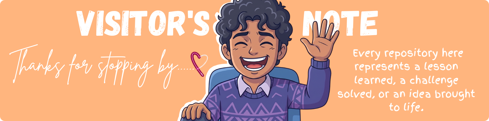

# Welcome to Arjjun's Digital Workshop
### Machine learning, Web apps, and a few experiments that escaped the whiteboard.

  

I'm Arjjun, a Machine Learning Engineer and AI researcher passionate about building intelligent products that solve real-world problems.

I enjoy working at the intersection of Artificial Intelligence, Computer Vision, Mobile Development, and Full Stack Engineering. Whether it's training deep learning models, developing Flutter applications, or publishing research, I love transforming ideas into practical software.

Currently exploring scalable AI systems, multimodal learning, and modern software architecture.

## Featured Projects

<table width="100%" border="0" cellpadding="8" cellspacing="0">
  <tr valign="top">
    <!-- PosePilot AI -->
    <td width="50%">
      <h3>PosePilot AI</h3>
      
AI-powered mobile application that recommends professional poses using computer vision and AI.

      

        
        
        
        
      

      

        <a href="https://github.com/Arjjun-S/PosePilot-AI"><b>📂 View Code</b></a>
      

    </td>
    <!-- CXR8 -->
    <td width="50%">
      <h3>CXR8</h3>
      
Research project on multi-label thoracic disease classification using Deep Learning and Vision Transformers.

      

        
        
        
        
      

      

        <a href="https://github.com/Arjjun-S/CXR8"><b>📂 View Code</b></a>
      

    </td>
  </tr>
  <tr valign="top">
    <!-- ScrapeSRM -->
    <td width="50%">
      <h3>ScrapeSRM</h3>
      
Secure student portal analytics platform with encrypted authentication and modern dashboards.

      

        
        
        
        
      

      

        <a href="https://github.com/Arjjun-S/ScrapeSRM"><b>📂 View Code</b></a>
      

    </td>
    <!-- Brochify -->
    <td width="50%">
      <h3>Brochify</h3>
      
Canva-inspired brochure and certificate generator with AI-assisted content creation.

      

        
        
        
        
      

      

        <a href="https://github.com/Arjjun-S/Brochify"><b>📂 View Code</b></a>
      

    </td>
  </tr>
  <tr valign="top">
    <!-- InfinityVoid Browser -->
    <td width="50%">
      <h3>InfinityVoid Browser</h3>
      
Web browser optimized for 3D web environments and virtual spaces with robust security protocols.

      

        
        
        
        
      

      

        <a href="https://github.com/Arjjun-S/InfinityVoid-Browser"><b>📂 View Code</b></a>
      

    </td>
    <!-- SyncSpeaker -->
    <td width="50%">
      <h3>SyncSpeaker</h3>
      
Real-time cross-device audio synchronization tool for creating ad-hoc multi-speaker sound systems.

      

        
        
        
        
      

      

        <a href="https://github.com/Arjjun-S/SyncSpeaker"><b>📂 View Code</b></a>
      

    </td>
  </tr>
</table>

## Research

Researching intelligent healthcare systems using Deep Learning and Computer Vision.

Current interests include:
* **Medical Image Analysis**
* **Explainable AI (XAI)**
* **Vision Transformers (ViTs)**
* **Natural Language Processing (NLP)**
* **Healthcare AI**

## Abilities I Have

<table width="100%" border="0" cellpadding="10" cellspacing="0">
  <tr valign="middle">
    <!-- Left Column: Static Image (35% width) -->
    <td width="35%" align="center">
      
    </td>
    <!-- Right Column: Technology Icons (65% width) -->
    <td width="65%">
      <b>Languages</b> 
      
      
      
      
      
      
        
      <b>Artificial Intelligence</b> 
      
      
      
      
      
      
      
        
      <b>Mobile</b> 
      
      
        
      <b>Web</b> 
      
      
      
      
      
        
      <b>Database</b> 
      
      
      
      
      
        
      <b>Cloud &amp; DevOps</b> 
      
      
      
      
      
    </td>
  </tr>
</table>

## GitHub Activity

    
    
    
    
  

## Goals

* **2026**
  * Publish quality research
  * Build impactful AI products
  * Contribute to Open Source
* **2027**
  * Secure an ML Internship
  * Deepen Cloud & MLOps knowledge
  * Build production-scale AI systems
* **2028**
  * Machine Learning Engineer
  * Open Source Contributor
  * AI Product Builder

## Beyond Code

<table width="100%" border="0" cellpadding="10" cellspacing="0">
  <tr valign="top">
    <!-- Left Column: Text (60% width) -->
    <td width="60%">
      When I'm not coding, you'll probably find me:
      <ul>
        <li>Reading AI research papers</li>
        <li>Experimenting with new technologies</li>
        <li>Designing modern user interfaces</li>
        <li>Building side projects</li>
        <li>Learning something completely new</li>
      </ul>
    </td>
    <!-- Right Column: Rounded Image (40% width) -->
    <td width="40%" align="center">
      
    </td>
  </tr>
</table>

## Favorite Quote

<blockquote>"The best way to predict the future is to build it."</blockquote>

## Let's Connect

  
  &nbsp;&nbsp;&nbsp;&nbsp;&nbsp;&nbsp;&nbsp;&nbsp;
  
  &nbsp;&nbsp;&nbsp;&nbsp;&nbsp;&nbsp;&nbsp;&nbsp;
  
  &nbsp;&nbsp;&nbsp;&nbsp;&nbsp;&nbsp;&nbsp;&nbsp;
  

  

